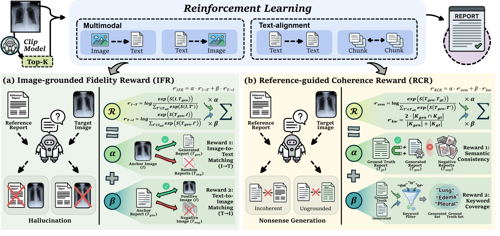

<div align="center">

# Dual-Anchor Reward-Aware Reinforcement Learning

### Retrieval-augmented medical report generation with image-grounded and reference-guided rewards

[](#citation)
[](#method-at-a-glance)
[](#experimental-results)
[](#release-status)

**Haocheng Gao<sup>1,#</sup>, Peizhi Zhao<sup>1,#</sup>, Longteng Kong<sup>2</sup>, Yu Chen<sup>3</sup>, Wanting Zhou<sup>1,*</sup>**

<sup>1</sup> Beijing University of Posts and Telecommunications<br>
<sup>2</sup> Beijing Forestry University<br>
<sup>3</sup> Beijing Tiantan Hospital, Capital Medical University

<sup>#</sup> Equal contribution &nbsp;&nbsp; <sup>*</sup> Corresponding author

**Accepted at the 2026 IEEE International Conference on Multimedia and Expo (ICME 2026)**

</div>

---

## Overview

Medical report generators must use retrieved reports without losing sight of the
patient image. This repository accompanies **Dual-Anchor Reward-Aware
Reinforcement Learning for Medical Report Generation**, which introduces a
retrieval-augmented PPO framework that balances two complementary objectives:

- **Image-grounded Fidelity Reward (IFR):** keeps the generated report aligned
  with visual evidence and discourages hallucinated findings.
- **Reference-guided Coherence Reward (RCR):** uses retrieved reports to improve
  clinical coherence, semantic consistency, and keyword coverage.

The two rewards are combined as

$$
r_{\mathrm{DAR}} = \lambda_I r_{\mathrm{IFR}} + \lambda_R r_{\mathrm{RCR}}.
$$

## Framework

<p align="center">
  
</p>

<p align="center"><em>
Adaptive Top-k retrieval conditions a Mistral-based generator; PPO then aligns
the policy with image-grounded fidelity and reference-guided coherence rewards.
</em></p>

## Method at a Glance

```text
Chest X-ray
    |
    v
CLIP-style image-text embedding
    |
    v
Adaptive Top-k retrieval with leave-one-out filtering
    |
    v
Visual semantic prompt + retrieved report evidence
    |
    v
Mistral-7B-Instruct-v0.2 report generator
    |
    v
PPO alignment with IFR + RCR
    |
    v
Image-grounded and clinically coherent report
```

| Component | Role |
|---|---|
| Cross-modal retriever | Learns a shared image-report space with symmetric InfoNCE. |
| Adaptive Top-k evidence | Selects sample-dependent evidence while excluding trivial matches. |
| Retrieval-conditioned generator | Combines compact visual semantics with retrieved report snippets. |
| IFR | Rewards bidirectional image-to-text and text-to-image consistency. |
| RCR | Rewards semantic consistency and clinical keyword coverage. |
| PPO alignment | Optimizes task-level rewards while staying close to a reference policy. |

For the paper-level formulation, see [Method Details](docs/METHOD.md) and
[Conceptual Pseudocode](docs/PSEUDOCODE.md).

## Experimental Results

Experiments use **MIMIC-CXR** and standard report-generation metrics. The method
obtains the strongest reported results in the paper comparison on BLEU-1,
BLEU-3, BLEU-4, and METEOR.

| Metric | Ours | Best prior result in the comparison | Summary |
|:---|---:|---:|:---:|
| BLEU-1 | **0.407** | 0.396 | Best |
| BLEU-2 | 0.247 | **0.250** | Competitive |
| BLEU-3 | **0.170** | 0.169 | Best |
| BLEU-4 | **0.137** | 0.124 | Best |
| ROUGE-L | 0.271 | **0.291** | Room for improvement |
| METEOR | **0.190** | 0.162 | Best |
| CIDEr | 0.345 | **0.362** | Competitive |

### Retrieval and reinforcement-learning ablation

| Setting | B-1 | B-2 | B-3 | B-4 | R-L | MTR | CIDEr |
|---|---:|---:|---:|---:|---:|---:|---:|
| Top-1 + original generator | 0.243 | 0.110 | 0.080 | 0.077 | 0.189 | 0.087 | 0.165 |
| Adaptive Top-k + original generator | 0.342 | 0.186 | 0.132 | 0.095 | 0.218 | 0.117 | 0.195 |
| **Adaptive Top-k + PPO alignment** | **0.407** | **0.247** | **0.170** | **0.137** | **0.271** | **0.190** | **0.345** |

Detailed comparison and reward-decomposition results are collected in
[Results and Ablations](docs/RESULTS.md).

## Repository Structure

```text
dual-anchor-rappo/
|- README.md
|- CITATION.cff
|- configs/
|  `- example_config.yaml
|- docs/
|  |- ALGORITHM_LATEX.tex
|  |- METHOD.md
|  |- OPEN_SOURCE_NOTES.md
|  |- PSEUDOCODE.md
|  |- RESULTS.md
|  `- assets/
|     `- dual_anchor_framework.png
`- src/
   `- dual_anchor_pseudocode.py
```

## Release Status

This repository currently provides a **paper-level conceptual release**. It is
intended to document the accepted method clearly while protecting sensitive
medical data and unreleased engineering assets.

Included:

- the public method structure and reward decomposition;
- paper-level pseudocode and mathematical notation;
- reported MIMIC-CXR results and ablations;
- a non-executable configuration schema.

Not included yet:

- patient data, DICOM files, reports, or identifiers;
- model checkpoints or private pretrained weight mirrors;
- executable training and evaluation pipelines;
- prompts, infrastructure-specific recipes, or private data processing code.

## Quick Start

```bash
git clone https://github.com/zpz999/dual-anchor-rappo.git
cd dual-anchor-rappo
```

Then review:

```bash
# Paper-level configuration schema
cat configs/example_config.yaml

# Conceptual algorithm flow
cat docs/PSEUDOCODE.md
```

The current release is intentionally non-executable; these commands inspect the
public documentation rather than start model training.

## Citation

If this work is useful in your research, please cite:

```bibtex
@inproceedings{gao2026dualanchor,
  title     = {Dual-Anchor Reward-Aware Reinforcement Learning for Medical Report Generation},
  author    = {Gao, Haocheng and Zhao, Peizhi and Kong, Longteng and Chen, Yu and Zhou, Wanting},
  booktitle = {2026 IEEE International Conference on Multimedia and Expo (ICME)},
  year      = {2026},
  note      = {Accepted}
}
```

The citation will be updated when the official proceedings record and DOI are
available.

## Medical and Responsible-Use Notice

Generated reports are research outputs and must not be used for clinical
decision-making without review by qualified medical professionals. Any future
release must comply with the MIMIC-CXR data-use agreement and applicable privacy,
security, and institutional requirements.
